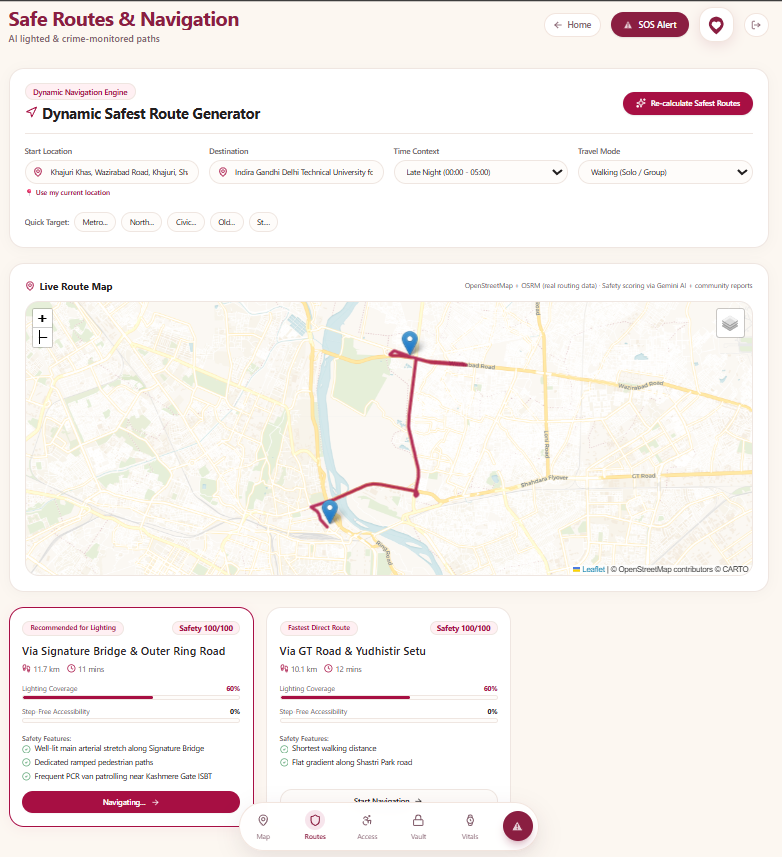
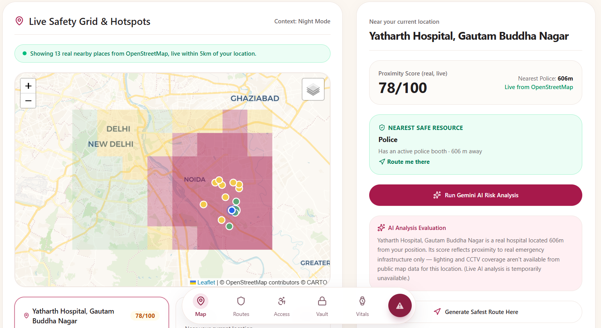
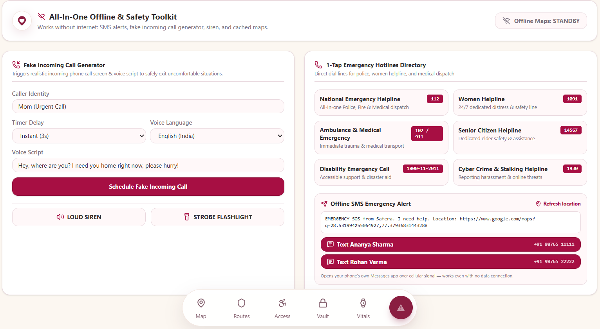
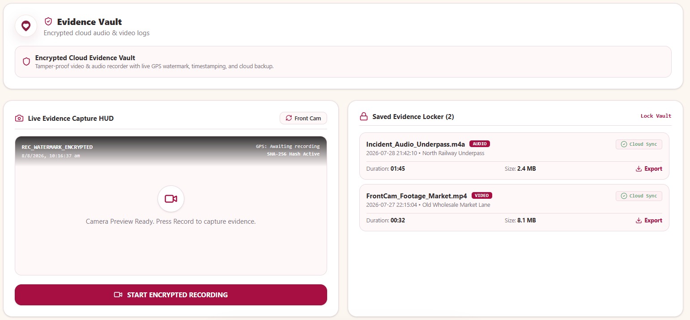
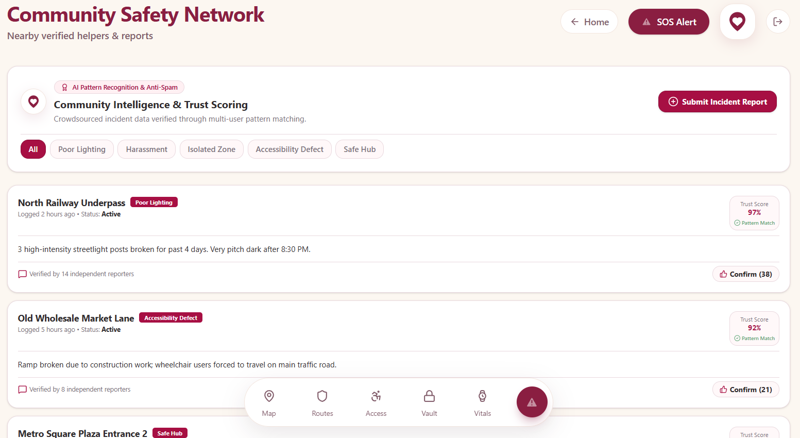

# Safera

Safera is an AI-powered personal safety and accessibility platform built for women and vulnerable commuters. It combines real-time risk assessment, safe route guidance, emergency response tools, evidence capture, and legal support into one mobile-first experience.

## Why it exists

Many people still travel without a reliable safety layer — especially in unfamiliar areas, during late hours, or when connectivity is weak. Safera aims to make safety feel proactive, accessible, and actionable.

## Core features

- AI-based safety mapping with live risk insights
- Safer route generation instead of just shortest-route navigation
- SOS and emergency tools that work online and offline
- Live location sharing with trusted contacts
- Motion-based safety detection for falls, shaking, or inactivity
- Evidence vault for capturing and storing safety evidence
- Legal rights guidance for emergencies and police interactions
- Accessibility mapping for inclusive navigation
- Community-driven safety reporting
- AI safety companion for support and guidance

## Feature highlights

### 1. Safe route planning
Guide users through safer paths with route suggestions and location-based awareness.



### 2. Smart safety map
Show live safety insights, risk areas, and nearby support points in one place.



### 3. Emergency toolkit
Provide instant help with SOS, siren, fake call, flashlight, and offline fallback controls.



### 4. Evidence vault
Let users securely collect and organize evidence such as photos, notes, and recordings.



### 5. AI companion and community support
Offer conversational support and local safety reporting in one experience.



## Tech stack

- React + TypeScript
- Vite
- Tailwind CSS
- Leaflet / OpenStreetMap-based mapping
- Express server

## Run locally

```bash
npm install
npm run dev
```

## Build

```bash
npm run build
```
